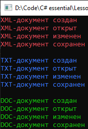

# Lesson4_task2
Условия задачки:
>Используя Visual Studio, создайте проект по шаблону Console Application.  
Требуется:  
Создайте класс AbstractHandler. 
В теле класса создать методы void Open(), void Create(), void Chenge(), void Save(). 
Создать производные классы XMLHandler, TXTHandler, DOCHandler от базового класса AbstractHandler. 
Написать программу, которая будет выполнять определение документа и для каждого формата должны быть методы открытия, создания, редактирования, сохранения определенного формата документа.  

Подытог: вот такенный майндфак на выходе
>
